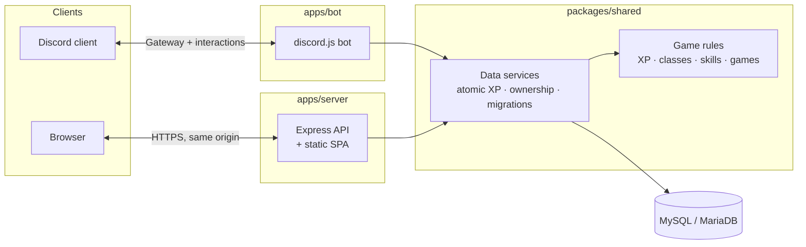

# TaskQuest

TaskQuest is a gamified task manager. You keep to-do lists, and finishing work earns XP, levels, classes, skills and achievements. There are also a few mini-games for spending or winning XP.

You can use it in two places, and both share one account and one database:

- **Discord bot**: slash commands, buttons and modals inside any server, plus deadline reminders by DM.
- **Web app**: a React dashboard with Discord sign-in, visual skill trees, a leaderboard, and three web-only arcade games.

A task completed in Discord shows up on the web immediately, and a class bought on the web applies in Discord.

> This repository merges the former `taskquest-botv2` (bot v3.8.3) and `taskquest-web_deploy` (web v1.5) repositories into a single monorepo (v4.0.0). See [CHANGELOG.md](CHANGELOG.md) for what changed.

---

## Contents

- [Features](#features)
- [Architecture](#architecture)
- [Repository layout](#repository-layout)
- [Quick start](#quick-start)
- [Scripts](#scripts)
- [Configuration](#configuration)
- [Documentation](#documentation)
- [Security](#security)

## Features

| Area | What you get |
|---|---|
| **Tasks** | Lists with description, category, priority and deadline. Tasks can be added, edited, reordered, completed and searched. |
| **Progression** | XP for creating lists, adding tasks and completing tasks. Levels come from lifetime XP. There is a daily reward with streaks. |
| **Classes** | Seven classes (Default, Hero, Gambler, Assassin, Wizard, Archer, Tank), each changing how XP is earned. |
| **Skills** | 27 skills in 7 trees, all with real effects that work the same on both platforms. |
| **Achievements** | 30 achievements for lists, tasks, XP, levels, streaks, classes and games. |
| **Games** | Blackjack (bet XP, with double down), Rock Paper Scissors and Hangman on both platforms; Snake, Dino Runner and Space Invaders on the web. Every outcome is decided by the server. |
| **Automation** | Deadline reminder DMs, and optional clean-up of old lists. |
| **Leaderboard** | Top players by XP. Discord IDs are never exposed. |

## Architecture



- **`@taskquest/shared`** is the single source of truth. Every XP change, purchase and game outcome happens there, inside a database transaction that locks the user's row. The bot and the API only render results.
- **The web app is served by the API on the same origin.** Session cookies are first-party, `SameSite=Lax`, and protected against CSRF.
- **The schema is owned by versioned migrations.** These are idempotent and lock-protected, and both apps run them on startup.

More detail is in [docs/ARCHITECTURE.md](docs/ARCHITECTURE.md).

## Repository layout

```
TaskQuest-Application/
├── apps/
│   ├── bot/        Discord bot (CommonJS, discord.js 14)
│   ├── server/     Express API + Discord OAuth, serves the built web app
│   └── web/        React 18 + Vite + Tailwind + shadcn/ui single-page app
├── packages/
│   └── shared/     @taskquest/shared: rules, validation, DB services, migrations
├── db/legacy/      Historical SQL scripts (do not run; see its README)
├── docs/           Product, architecture, API, gameplay, deployment docs
├── scripts/        Repository tooling
└── render.yaml     Render blueprint (web service + bot worker)
```

## Quick start

**Requirements:** Node.js 20+ and npm 10+, and a MySQL 8 or MariaDB 10.4+ database. XAMPP works for local development. You also need a Discord application from the [developer portal](https://discord.com/developers/applications).

```bash
git clone https://github.com/Mist10148/TaskQuest-Application.git
cd TaskQuest-Application
npm install
```

1. **Create a database.** Use something like `CREATE DATABASE taskquest CHARACTER SET utf8mb4;`.
2. **Configure.** One `.env` at the repository root is shared by the bot, the web server and the web build:
   ```bash
   cp .env.example .env
   ```
   - Fill in `DISCORD_TOKEN`, `CLIENT_ID`/`DISCORD_CLIENT_ID`, `DISCORD_CLIENT_SECRET`, `SESSION_SECRET` and the database settings.
   - In the Discord portal, add the OAuth2 redirect `http://localhost:8080/api/auth/callback`.
3. **Create the tables.** Both apps also do this on startup.
   ```bash
   npm run db:migrate
   ```
4. **Register the slash commands.** Use `-- --guild=<id>` for instant updates in a test server.
   ```bash
   npm run deploy:commands -- --guild=YOUR_TEST_GUILD_ID
   ```
5. **Run everything.** Use three terminals:
   ```bash
   npm run dev:server   # API on http://localhost:3001
   npm run dev:web      # Web app on http://localhost:8080 (proxies /api)
   npm run dev:bot      # Discord bot
   ```

Open <http://localhost:8080> and log in with Discord.

## Scripts

| Command | What it does |
|---|---|
| `npm run dev:web` / `dev:server` / `dev:bot` | Run each app in watch mode |
| `npm run build` | Build the web app into `apps/web/dist` |
| `npm run start:server` / `start:bot` | Production start |
| `npm run db:migrate` | Apply pending database migrations |
| `npm run deploy:commands` | Register Discord slash commands (`-- --guild=ID` for one guild) |
| `npm run lint` / `typecheck` | ESLint and TypeScript for the web app |
| `npm run check` | `node --check` every Node source file |
| `npm test` | Unit tests. Integration tests also run when `TEST_DB_NAME` is set (see [CONTRIBUTING.md](CONTRIBUTING.md)). |

## Configuration

All apps share one git-ignored `.env` at the repository root, documented in [`.env.example`](.env.example) and [docs/DEPLOYMENT.md](docs/DEPLOYMENT.md#3-environment-variables). Settings are read in this order, and the first one found wins:

1. Real environment variables (Render, CI, your shell).
2. Optional per-app overrides in `apps/bot/.env` or `apps/server/.env`.
3. The root `.env`.

Vite only exposes `VITE_*` variables to the browser, so the secrets in that file never reach the client.

## Documentation

| Document | Contents |
|---|---|
| [docs/PRD.md](docs/PRD.md) | Product requirements: goals, personas, user stories, requirements, roadmap |
| [docs/ARCHITECTURE.md](docs/ARCHITECTURE.md) | Components, data flow, transactions, security design |
| [docs/API.md](docs/API.md) | Every REST endpoint with request and response shapes |
| [docs/COMMANDS.md](docs/COMMANDS.md) | Every Discord command and interaction |
| [docs/GAMEPLAY.md](docs/GAMEPLAY.md) | XP, levels, classes, skills, achievements and game rules, with exact numbers |
| [docs/DATABASE.md](docs/DATABASE.md) | Schema, migrations, and upgrading a legacy database |
| [docs/DEPLOYMENT.md](docs/DEPLOYMENT.md) | Render, environment variables, Discord setup, operations |
| [docs/KNOWN_ISSUES.md](docs/KNOWN_ISSUES.md) | Known limitations and the roadmap |
| [SECURITY.md](SECURITY.md) | Security model, fixed vulnerabilities, required secret rotation, reporting |
| [CONTRIBUTING.md](CONTRIBUTING.md) | Development workflow, tests, conventions |
| [CHANGELOG.md](CHANGELOG.md) | Release history |

## Security

If you deployed the old repositories, rotate your Discord bot token, OAuth client secret and session secret. [SECURITY.md](SECURITY.md#1-required-action-rotate-leaked-secrets) explains why. Report vulnerabilities privately as described in [SECURITY.md](SECURITY.md#5-reporting-a-vulnerability).
