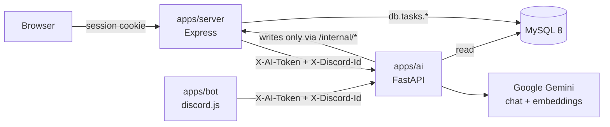
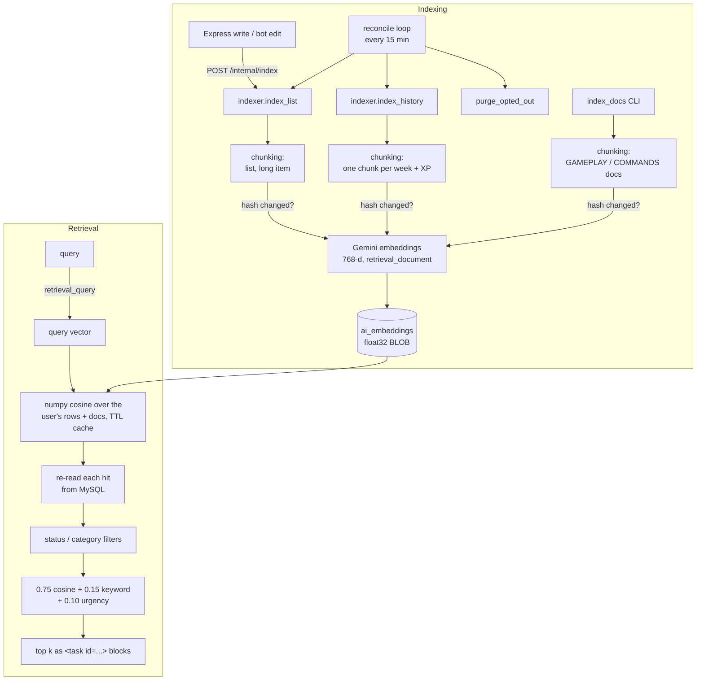
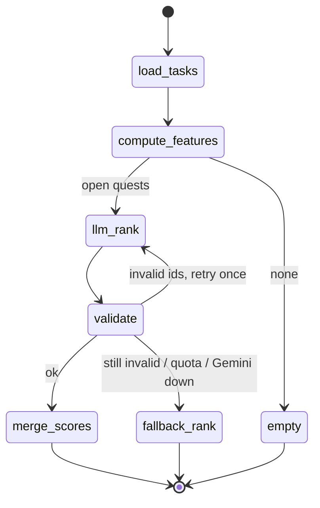
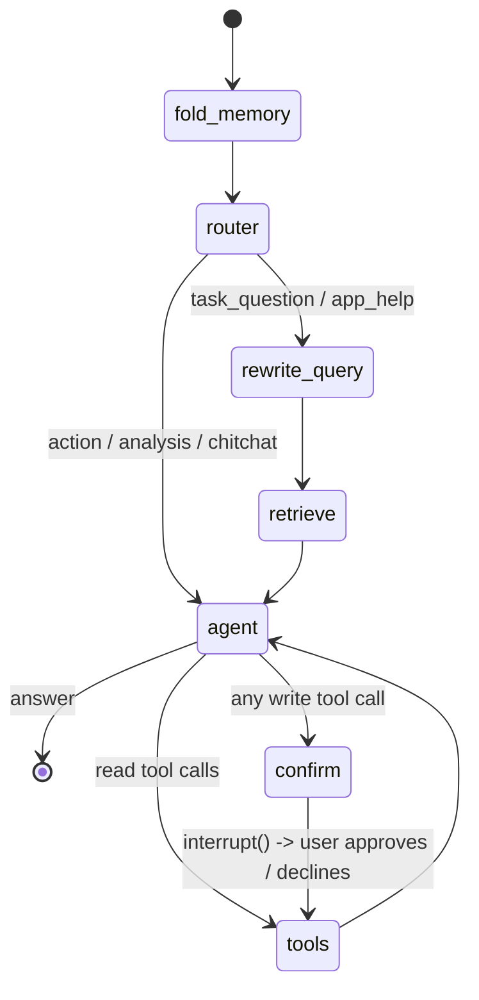

# AI Architecture (LangChain + LangGraph)

How the TaskQuest AI service is put together, as built. For the original design, the success criteria and the build phases, see [AI_INTEGRATION.md](AI_INTEGRATION.md). For the endpoints, see [API.md](API.md).

## Contents

1. [Overview](#1-overview)
2. [Where LangChain and LangGraph are used](#2-where-langchain-and-langgraph-are-used)
3. [RAG pipeline](#3-rag-pipeline)
4. [Summarizer (LCEL chain)](#4-summarizer-lcel-chain)
5. [Prioritizer graph](#5-prioritizer-graph)
6. [Chat graph](#6-chat-graph)
7. [Discord conversation (converse)](#7-discord-conversation-converse)
8. [Persistence: the MySQL checkpointer](#8-persistence-the-mysql-checkpointer)
9. [Prompts and the persona](#9-prompts-and-the-persona)
10. [Guardrails](#10-guardrails)
11. [Request lifecycles](#11-request-lifecycles)
12. [Testing](#12-testing)
13. [Design decisions](#13-design-decisions)

---

## 1. Overview



- **Express is the only public entry point.** The browser never reaches the AI service. Express (or the bot) passes the trusted Discord ID in a header. The AI service checks a shared token with `hmac.compare_digest`.
- **The AI service reads the database directly but never writes tasks.** Every change goes through Express `/internal/*`, so XP, achievements and validation follow the same rules as the web UI and the bot.
- **Every query is scoped by `discord_id`.** The model never sees or sets it: tool argument schemas use `extra="forbid"` and have no `discord_id` field.

## 2. Where LangChain and LangGraph are used

| Piece | Library | File |
|---|---|---|
| Chat and embedding models | `langchain-google-genai` (`ChatGoogleGenerativeAI`, `GoogleGenerativeAIEmbeddings`) | `app/llm.py` |
| Structured output (+ token counts, safety blocks) | `with_structured_output(include_raw=True)` | `app/llm_call.py` |
| Summarizer | LCEL: `ChatPromptTemplate \| RunnableLambda` | `app/chains/summarize.py` |
| Prioritizer | LangGraph `StateGraph` with a retry loop | `app/graphs/prioritize.py` |
| Chat agent | LangGraph `StateGraph` + `MessagesState`, `interrupt()`, `Command(resume=...)`, `RemoveMessage` | `app/graphs/chat.py` |
| Discord conversation | The chat graph in read-only mode | `app/graphs/converse.py` |
| Tools | `StructuredTool.from_function`, used only to describe tools to the model | `app/tools/specs.py` |
| Retriever adapter | `BaseRetriever` / `Document` | `app/rag/retriever.py` (`TaskRetrieverLC`) |
| Conversation memory | Custom `BaseCheckpointSaver` on MySQL | `app/graphs/checkpointer.py` |
| Tracing | LangSmith, if `LANGSMITH_API_KEY` is set | `app/observability.py` |

The LangChain packages are pinned to the major versions CI tests against (`pyproject.toml`), because the checkpointer implements `langgraph-checkpoint`'s base class.

## 3. RAG pipeline



- **Chunks:** one per quest (name, description, category, deadline, priority and its subtasks), one per subtask longer than 300 characters, one per week of completed subtasks with the XP earned that week, and the help docs split by heading.
- **Only changed text is embedded.** Each chunk stores a SHA-256 `content_hash`. Unchanged chunks are only "touched" so the reconcile job stops flagging them.
- **Staying fresh:** web writes and bot edits trigger a fire-and-forget `/internal/index`. The reconcile loop catches anything missed: changed lists, new completions or XP for history, and users who opted out, whose vectors are deleted. Toggling AI in settings re-indexes or purges straight away.
- **Retrieval reads fresh data.** Stored vectors only decide which quests are candidates. The text shown to the model is rebuilt from MySQL, so completion state is never stale.
- **Filters:** a `status` or `category` filter drops doc chunks. History chunks count as finished work, so they appear only under `status="done"`.
- **Vector store:** MySQL plus numpy, so there is no extra infrastructure. [AI_INTEGRATION.md §17](AI_INTEGRATION.md) lists when to move to a dedicated vector database.

## 4. Summarizer (LCEL chain)

```
render_input (DB -> compact text + valid ids)
  -> cache lookup (ai_summary_cache, keyed by input hash)
  -> [map-reduce if > SUMMARY_MAP_REDUCE_CHARS]
  -> SUMMARY_PROMPT | RunnableLambda(structured_call -> Summary)
  -> clean(): drop ids not in the input, retry once with the invalid ids named
  -> cache store
```

Template variables are substituted as plain text, so braces in quest names cannot break the prompt. The `/v1/summary` modes are `list`, `digest` (today's briefing) and `recap` (what you finished).

## 5. Prioritizer graph



- `compute_features` computes a deterministic baseline score from overdue days, priority, deadline proximity and progress.
- `merge_scores` blends the model's rank with that baseline. An overdue HIGH-priority quest can never be ranked below the top 3.
- `fallback_rank` uses the baseline alone and template reasons, so the feature still works without Gemini.
- More than 15 open quests switches to the reasoning model. Results are cached for 5 minutes per open-task set; fallback results are never cached.

## 6. Chat graph



| Node | What it does |
|---|---|
| `fold_memory` | Past `fold_at` messages, summarizes everything except the newest `keep` into `summary` and deletes those messages (`RemoveMessage`). |
| `router` | Structured `RouterOut` (intent, status and category filters). Falls back to `task_question` if anything fails. |
| `rewrite_query` | Turns a follow-up ("and the other one?") into a standalone search query. |
| `retrieve` | The RAG step: docs for `app_help`, tasks and history otherwise. |
| `agent` | Gemini with tools bound. Adds the summary, retrieved context and today's date to the system prompt. Stops offering tools once `MAX_TOOL_ITERATIONS` is reached. A blocked or empty reply becomes a fixed friendly message. An attached image is added from the run config for this call only. |
| `confirm` | Builds a preview for each write call, then calls `interrupt({"actions": [...]})`. The graph pauses and its state is checkpointed. Nothing has been written yet. |
| `tools` | Runs read tools. Runs write tools only when approved, through Express `/internal/*`. Each result becomes a `ToolMessage` plus a UI event (XP, sources). |

**Why a hand-written tools node and not the prebuilt `ToolNode`:** the node has to tell three cases apart (approved, declined, rejected before asking). It also attaches XP results and sources to UI events and injects a trusted `ToolContext` instead of model-visible arguments. `ToolNode` with `InjectedState` could do part of this, but it would spread the approval logic across two places.

**Streaming:** `chat_service.stream_turn` maps `graph.astream(stream_mode=["messages", "updates"])` to SSE events: `token`, `sources`, `tool`, `confirm`, `error` and `done`. Resuming is `Command(resume={"approved": bool})` on the same thread.

## 7. Discord conversation (converse)

The bot answers @mentions, replies to its own messages and DMs, Zephyr-style (`apps/bot/chat.js` → `POST /v1/converse`).

- **Same graph, read-only:** `build_chat_graph(..., prompt_name="converse_system", read_only=True, fold_at=20, keep=10)`.
  - Only read tools are bound, and the graph never routes to `confirm`.
  - A write call the model invents is answered with a refusal that points to `/ask` or the website.
- **Memory is per user per channel**, using thread id `uuid5("discord:<channel>:<user>")`. Zephyr shares memory across a channel; TaskQuest can't, because retrieval and tools read each user's private quests.
- **Threads are saved with `source='discord'`** (migration 005), so they never appear in the web app's thread list. `/forget` deletes the thread and its checkpoints.
- **Images:** only `https` URLs on Discord's CDN are fetched, up to 4 MB, image types only. The bytes go to Gemini through the run config and are never written to the checkpoint.
- **Output:**
  - The service returns one JSON reply.
  - The bot splits it at paragraph or line breaks, or sends it as `response.txt`.
  - `/ai-format` switches to embeds.
  - Replies never ping anyone (`allowedMentions: { parse: [] }`).

## 8. Persistence: the MySQL checkpointer

`MySQLCheckpointSaver` implements the async half of `BaseCheckpointSaver`: `aget_tuple`, `alist`, `aput`, `aput_writes` and `adelete_thread`.

- **Tables:**
  - `ai_checkpoints` holds one row per checkpoint, as a LONGBLOB serialized with LangGraph's serde.
  - `ai_checkpoint_writes` holds pending writes, including `__interrupt__`.
  - Both have a foreign key to `ai_chat_threads`, so every thread needs a row there.
- **Checkpoint ids are time-ordered**, so the latest checkpoint is simply the greatest id.
- **Special channels** (errors, interrupts, resume) overwrite their slot, as LangGraph expects; ordinary writes are insert-once.
- **Concurrency:** LangGraph saves checkpoints and writes from concurrent tasks, so every `engine.begin()` must get its own connection. MySQL's pool does this. The SQLite test database uses a temporary file with `NullPool` for the same reason; a single shared in-memory connection lost interrupt writes.

## 9. Prompts and the persona

```
CORE_RULES  (app/prompts.py: grounding, delimited data, ids, no invented XP, no claimed actions)
  + <feature prompt>.md  (chat_system / converse_system / summarize_system / prioritize_system / router_system)
  + persona.md           (only chat_system and converse_system, via load_prompt(name, persona=True))
```

- The persona copies the Zephyr bot's attitude:
  - It talks like a real person (a girl), and is calm, witty, kind and encouraging.
  - It teases back, and gets snappy or insulting when the user is rude.
  - No emojis. `*italics*` only for its own actions or thoughts, and the user's italics are read as actions.
  - It never walks away from the conversation.
- **Deliberately not copied:** Zephyr's sexual persona lines and its `BLOCK_NONE` safety settings. If someone sincerely asks whether it is human, it says it is TaskQuest's AI companion.
- **The persona comes last and says the rules above it win.** A character cannot talk its way past grounding or confirmations.
- **Each prompt's SHA-256 prefix is logged** with every call (`prompt=<version>`).

## 10. Guardrails

| Risk | Guard |
|---|---|
| Prompt injection in quest names | Task text is inside `<task id=...>` blocks, and CORE_RULES says that text is data. Red-team strings are in `tests/evals/injection.json`. |
| Model writes without consent | Writes need `interrupt()` and an explicit approval. Converse binds no write tools, and any invented write call is refused. |
| Cross-user access | `discord_id` comes from a trusted header, is never a tool argument, and every query is scoped by it. |
| Invented ids or XP | Ids are validated (summarizer and prioritizer retry, then drop unknown ids). XP is mentioned only when a tool result includes it. |
| Unsafe content | Gemini `safety_settings` set explicitly (harassment blocks only high-probability content, so the snappy persona still works). Blocked replies become a friendly message. |
| Runaway agents | `recursion_limit=40` and `MAX_TOOL_ITERATIONS`. |
| Cost | A per-user daily request quota checked before chat, resume, converse, summary and prioritize. Token usage goes to `ai_usage`. |
| Privacy | Opting out deletes the user's vectors at once and on every reconcile pass. Opted-out users are never sent to Gemini. |
| SSRF via attachments | Discord CDN host allow-list, https only, no redirects, size and type limits. |

## 11. Request lifecycles

**Web chat:** browser → `POST /api/ai/chat` (Express: session, opt-out, rate limit) → `POST /v1/chat` (quota, thread) → `stream_turn` → SSE piped back to the browser. A write pauses on `confirm`. **Approve** calls `/v1/chat/{id}/resume`, which runs `tools` and then `agent`.

**`/ask` (bot):** the same graph through `@taskquest/shared/ai` `chat()`, which collects the SSE stream. Write confirmations become Approve and Cancel buttons (`ai_ok:` / `ai_no:`).

**Mention, reply or DM:** discord.js `MessageCreate` → `chat.handleMessage` (AI enabled, opt-out, 3 s cooldown, mention stripped, attachment) → `converse()` → `/v1/converse` → read-only graph → one reply → split, file or embeds.

## 12. Testing

| Suite | What | Runs on |
|---|---|---|
| `tests/unit`, `tests/graphs` | Chunking, store, retriever, summarizer, prioritizer, chat and converse graphs, tools, security and persona red-team, images | Temporary SQLite files and fake models (`tests/fakes.py`) |
| `tests/evals` | Retrieval (50 queries), summary (with p95 latency and an optional `--judge`), prioritize golden sets | Offline in CI; `--live` with Gemini |
| `tests/mysql` | Real schema, foreign keys, checkpointer round trip, usage and embeddings SQL | MySQL 8 with the Node migrations applied (CI job `ai-mysql`) |
| `apps/bot/test/chat.test.js` | Mention, reply and DM handling, splitting, cooldown, opt-out, embeds | Node, with the AI client stubbed |

## 13. Design decisions

- **One chat graph, configured two ways:** web chat and `/ask` are full mode; Discord conversation is read-only. Same nodes, same tests, same guardrails.
- **Writes only through Express:** the AI service cannot drift from the game rules (XP, achievements, validation).
- **Vectors in MySQL:** fine at TaskQuest's size (thousands of chunks per user at most) and needs nothing new to deploy.
- **Deterministic fallbacks everywhere:** the prioritizer baseline, the router default, retrieval falling back to keyword search, and a fixed message for blocked replies. A Gemini outage degrades the AI features without breaking them.
