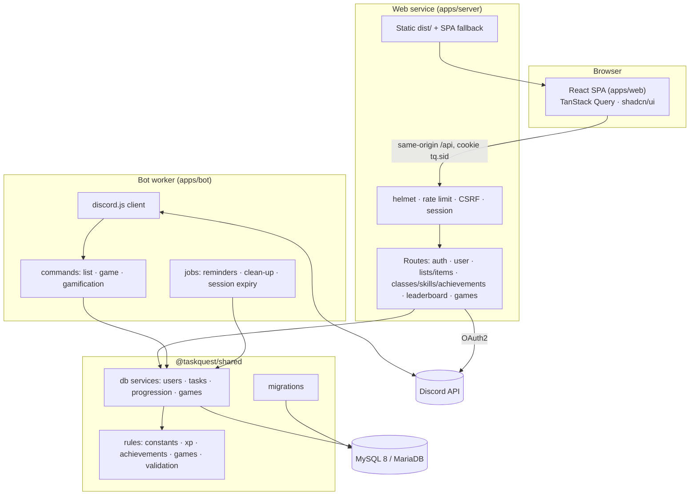
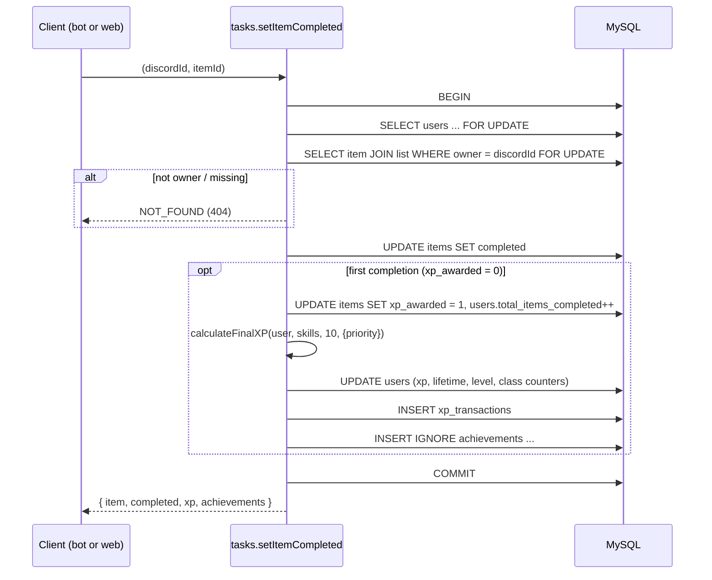

# Architecture

This document explains how TaskQuest is put together, how a request flows through it, and the design decisions that keep the two front ends consistent and the XP economy safe.

## Contents

1. [Components](#1-components)
2. [The shared package](#2-the-shared-package)
3. [Request flows](#3-request-flows)
4. [Transactions and concurrency](#4-transactions-and-concurrency)
5. [Games](#5-games)
6. [Web security design](#6-web-security-design)
7. [Bot design](#7-bot-design)
8. [Background jobs](#8-background-jobs)
9. [Configuration and startup](#9-configuration-and-startup)
10. [AI service](#10-ai-service)
11. [Testing strategy](#11-testing-strategy)

---

## 1. Components



| Component | Runtime | Responsibility |
|---|---|---|
| `apps/web` | Browser | UI only. It sends user decisions (create, toggle, bet, hit/stand, letter, arcade score) and renders server responses. |
| `apps/server` | Node 22, ESM, Express 4 | Discord OAuth2, sessions, HTTP security, request validation (zod), and mapping HTTP to shared services. Serves `apps/web/dist` in production. |
| `apps/bot` | Node 22, CommonJS, discord.js 14 | Discord commands and components, rendering embeds, background jobs and a health endpoint. |
| `packages/shared` | Node 22, CommonJS | Every rule, every SQL statement, migrations and the connection pool. |
| `apps/ai` (optional) | Python 3.12, FastAPI | Private service for the summarizer, prioritizer and chat (Gemini, LangChain, LangGraph). Reads task data through scoped queries; changes tasks only by calling Express `/internal/*` after the user confirms. See [AI_INTEGRATION.md](AI_INTEGRATION.md). |
| MySQL / MariaDB | — | The only state. There is no in-memory game or session state in either app. |

## 2. The shared package

Before 4.0, the bot and the web server each had their own copy of the classes, skills, achievements and XP formulas, plus their own SQL. The copies drifted. Achievement keys differed, completion XP was 8 on one platform and 10 on the other, the web's RPS paid back your bet as risk-free winnings, and each app ran its own conflicting `ALTER TABLE`s.

`@taskquest/shared` now owns all of that:

```
packages/shared/src
├── constants.js     CLASSES, SKILL_TREES, ACHIEVEMENTS, REWARDS, LIMITS, game config
├── xp.js            levelFromXP, calculateClassXP, getSkillBonuses, calculateFinalXP, calculateDailyReward
├── achievements.js  evaluateAchievements(stats, unlocked, events)
├── games/           blackjack.js · rps.js · hangman.js · arcade.js   (pure engines)
├── validation.js    listName, itemName, deadline, priority, escapeLike, ...
├── random.js        CSPRNG helpers (crypto.randomInt)
├── errors.js        TaskQuestError + factories
└── db/
    ├── pool.js      mysql2 pool (UTC, DATE as string, TLS), withTransaction
    ├── migrate.js   runner + information_schema helpers
    ├── migrations/  001_initial_schema.js, 002_upgrade_legacy.js
    ├── users.js     profile, settings, stats, leaderboard, reset
    ├── progression.js  applyXP, rewardAction, achievements, daily, classes, skills
    ├── tasks.js     owner-scoped lists/items, reminders, clean-up
    └── games.js     blackjack / rps / hangman / arcade services, expiry
```

**Rules are pure.** The `xp`, `achievements` and `games` modules do no I/O and take an injectable RNG, so they are unit-tested deterministically.

**Services are the only writers.** Apps never write SQL. Services validate input, enforce ownership, run in transactions, and throw `TaskQuestError(code, message, status)` for expected failures. The API maps `status` to an HTTP status. The bot shows `message` in an ephemeral embed. Any other error is treated as a bug: it is logged, and the user sees a generic message.

## 3. Request flows

### Completing a task (both platforms)



### Web login (Discord OAuth2)

1. `GET /api/auth/discord` creates a random 32-byte `state`, stores it in the session, and redirects to Discord with `scope=identify`.
2. Discord redirects back to `GET /api/auth/callback?code&state`.
3. The server compares `state` in constant time, exchanges the code (10s timeout), and fetches `/users/@me`.
4. The user row is created or updated with the cached username and avatar.
5. The session is **regenerated** (preventing session fixation) and the user is redirected to `/dashboard`.

## 4. Transactions and concurrency

Every XP change goes through `progression.applyXP(conn, user, amount, source, opts)`:

1. The caller has already locked the user row with `SELECT ... FOR UPDATE` inside `withTransaction`.
2. The new balance is computed from the locked row. A negative result throws `INSUFFICIENT_XP`.
3. `lifetime_xp` increases by `lifetimeDelta`, which defaults to the positive amount. Bet returns and refunds pass `0`. The level is derived from lifetime XP.
4. Whitelisted extra columns (class counters, ownership flags, streak fields) are updated in the same statement batch.
5. An `xp_transactions` row records the amount, the source, the before and after balances, and a reference ID.

Because the user row is locked for the whole operation, two concurrent requests for the same user run one after the other. A double-clicked "Buy class" charges once: the second request sees the ownership flag and fails with `CONFLICT`. A double-clicked "Stand" settles once: the second finds no active session. The integration tests check both cases.

Achievement unlocks happen in the same transaction (`INSERT IGNORE` on the unique key), so a reward and its achievement are never split.

## 5. Games

| Game | Where | State | Who decides the outcome |
|---|---|---|---|
| Blackjack | bot + web | `game_sessions.game_data` (deck, hands, bet) | Server (CSPRNG shuffle) |
| RPS | bot + web | single row, finished immediately | Server |
| Hangman | bot + web | `game_data` (word, guesses, lives) | Server |
| Snake / Dino / Invaders | web | session row created at start | Browser plays; server validates the score |

- **Hidden information stays on the server.** `publicView()` strips the deck, hides the dealer's hole card until the hand ends, and masks the Hangman word.
- **Escrow.** Starting Blackjack inserts the session and debits the bet in one transaction. Double down debits a second bet. Settling credits `bet + boosted winnings` (class and skill bonuses apply to winnings only) or returns the bet on a push. `finishSession` only updates rows with `state = 'active'`.
- **Expiry.** Active sessions older than 30 minutes are expired by the bot's job every 5 minutes. Escrowed bets are refunded with source `blackjack_refund`.
- **Free-game economy.**
  - RPS, Hangman and arcade rewards go through `rewardAction` with `maxXP` set to the remainder of the 500 XP per day cap.
  - A 3-second cooldown (`users.last_game_at`) throttles RPS and Hangman.
- **Arcade plausibility.**
  - The score must be at most `elapsed_seconds × maxPointsPerSecond + 1`. Elapsed time is measured by the database clock from the server-created session.
  - XP per run is capped at 100–150.
  - A run can be submitted only once.

## 6. Web security design

| Threat | Control |
|---|---|
| CSRF (e.g. hidden form posting to `/api/user/reset`) | `SameSite=Lax` cookie on a single origin. State-changing requests must carry an `Origin` or `Referer` matching `PUBLIC_URL`/`ALLOWED_ORIGINS`. Bodies must be `application/json`. Reset also needs `{"confirm":"RESET"}`. |
| Session fixation / theft | `session.regenerate()` at login. `httpOnly`, `secure` in production, cookie name `tq.sid`, store in MySQL. |
| Login CSRF | OAuth `state` bound to the session and compared in constant time. |
| IDOR | Ownership is part of every SQL statement (`JOIN lists ... WHERE discord_id = ?`). |
| XSS / clickjacking | helmet CSP (`script-src 'self'`, `frame-ancestors 'none'`, `img-src 'self' cdn.discordapp.com`). React escapes output. |
| Brute force / abuse | `express-rate-limit`: 900 requests per 15 min (general), 30 per 15 min (login), 90 per minute (games). |
| Mass assignment / bad input | `.strict()` zod schemas, then service-level validation. 16 KB body limit. |
| Information leaks | Generic 500s. The health check reveals no error text. The leaderboard has no Discord IDs. |
| Weak secrets | The server refuses to start in production without a SESSION_SECRET of 32+ characters. No fallback secret. |

See [SECURITY.md](../SECURITY.md) for the full list of fixed vulnerabilities.

## 7. Bot design

- **Intents:** `Guilds` only. No privileged intents are needed: commands arrive as interactions, and DMs are sent, never read.
- **Routing:** `index.js` dispatches by interaction type and `customId` prefix to `commands/list.js`, `commands/game.js` or `commands/gamification.js`.
- **Ownership:** `/list` replies are public, so anyone in the channel can click their buttons. Every handler passes the clicking user's ID to the services, so clicks on someone else's list only ever return "not found".
- **Privacy:** XP, achievements, games and `/profile` are ephemeral. `/profile @user` never creates a row for the target.
- **Errors:** `utils/respond.js#handleError` turns `TaskQuestError` into a friendly embed. Anything else is logged with its stack and shown as a generic message.

## 8. Background jobs

All jobs run in the bot process. Each is wrapped so that a failure is logged and never crashes the process.

| Job | Schedule | What it does |
|---|---|---|
| Deadline reminders | 5s after ready, then hourly | DMs owners of lists due today (UTC) whose `automation_enabled` is on. Each list is marked notified even if the DM fails (closed DMs). |
| Old-list clean-up | 10s after ready, then daily | One `DELETE ... JOIN` query (see [DATABASE.md](DATABASE.md#automation-queries)). |
| Game session expiry | On ready, then every 5 min | Expires sessions older than 30 minutes and refunds escrowed bets. |

## 9. Configuration and startup

**Server** (`apps/server/index.js`):

1. `validateConfig()` checks `PUBLIC_URL`, the Discord credentials, and `SESSION_SECRET` (≥32 characters in production).
2. It pings the database.
3. It runs migrations, or only verifies them if `MIGRATE_ON_START=false`.
4. It starts listening and handles SIGTERM/SIGINT with a graceful close.

**Bot** (`apps/bot/index.js`):

1. It requires `DISCORD_TOKEN`.
2. It pings the database and runs migrations.
3. It starts the health endpoint on `$PORT` (200 when connected to Discord, 503 otherwise) and logs in.

Migrations take a MySQL named lock (`GET_LOCK('taskquest_migrations')`), so the bot and server can start at the same moment safely.

## 10. AI service

The optional AI service keeps the same rules as everything else:

- **Express is the only public entry.** It authenticates the session, rate-limits, validates with zod and forwards to the AI service with a shared secret (`X-AI-Token`) and the trusted Discord ID. The browser never talks to the AI service and never chooses whose data is read.
- **One place for XP.** The AI never awards XP or edits task tables. Write tools call `POST/PATCH /internal/*` on Express, which runs the same `db.tasks.*` services as the public API, so XP, achievements and validation are identical.
- **Confirmation before any change.** A write tool pauses the LangGraph run (`interrupt`); the UI shows a card; the change runs only when the user approves. Pending confirmations are checkpointed in MySQL, so they survive reloads and restarts.
- **Scoped reads.** Every repository function takes `discord_id` (enforced by a unit test); `discord_id` is never a tool argument; extra tool arguments are rejected.
- **Degrades gracefully.** The prioritizer falls back to a deterministic ranking when Gemini is unavailable or the quota is used. The app is healthy without the AI service.
- **Schema stays in Node.** The AI tables come from migration `003_ai`; the Python service never runs DDL.

## 11. Testing strategy

| Layer | Tests | Needs DB |
|---|---|---|
| Rules | `packages/shared/test/rules.test.js`: formulas, engines, validation with a deterministic RNG | No |
| Services | `packages/shared/test/db.integration.test.js`: ownership, farming, races, escrow, refunds, caps | Yes |
| HTTP | `apps/server/test/api.integration.test.js`: headers, auth, CSRF, validation, IDOR, games, privacy | Yes |
| Bot | `apps/bot/test/flows.integration.test.js`: every command flow with fake interactions | Yes |
| Web | `tsc` + ESLint + `vite build` | No |
| AI client, internal token, AI schemas | `apps/server/test/ai.test.js` against a stub AI service | No |
| AI service | `apps/ai/tests`: chunking, vector store, indexer, summarizer, prioritizer paths, chat graph (routing, tools, confirmation, memory), checkpointer, red-team prompts. Offline, with fake models and in-memory SQLite. | No |

Integration tests are skipped unless `TEST_DB_NAME` points at a throwaway database. CI provides a MySQL 8 service. See [CONTRIBUTING.md](../CONTRIBUTING.md#testing).
